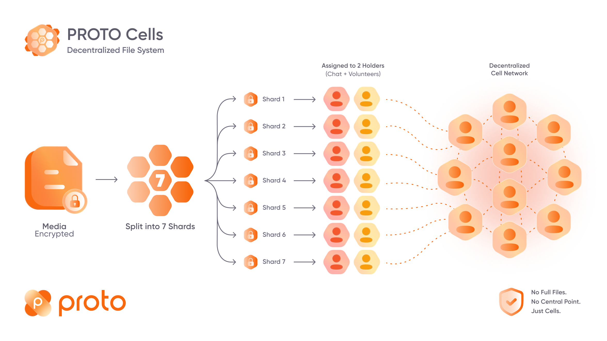
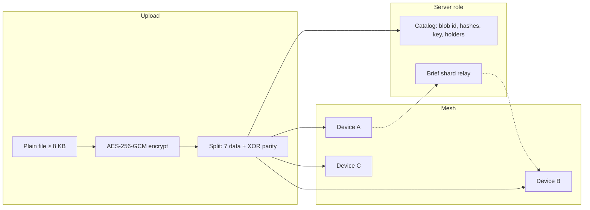

# PROTO Cells

<div align="center">



</div>

**PROTO Cells** — взаимная зашифрованная сеть хранения медиа в PROTO. Фото, видео и файлы из чатов не лежат целиком на одном сервере: клиенты делят их на **зашифрованные шарды** и хранят у себя на устройствах участников и волонтёров сети.

> **Client-only repo:** здесь описана логика **Android-клиента**. Каталог и кратковременный relay шардов обслуживает backend (`/api/cells.php`), который в этот репозиторий не входит.

С **1.1.5** Cells **обязателен** для всех аккаунтов PROTO: при входе клиент автоматически регистрирует устройство как участника mesh.

---

## Зачем это нужно

| Без Cells | С Cells |
|-----------|---------|
| Медиа завязано на центральное хранилище | Нагрузка распределена по устройствам |
| Один сбой — риск потери файла | Тройная репликация шардов |
| Дорого масштабировать | Сервер хранит **каталог**, а не полные копии |

Правило честности: **твоё медиа хостят другие — значит, ты тоже хостишь их зашифрованные фрагменты** (в пределах квоты на диске).

---

## Как это работает (кратко)



1. **Публикация** — при отправке медиа ≥ **8 KB** (`MIN_BLOB_BYTES`) файл шифруется, режется на **7 шардов**, регистрируется в каталоге, шарды пушатся на сервер и сохраняются локально.
2. **Хранение** — каждый держатель хранит только **gzip-сжатый фрагмент** (`PCGZ` + gzip). Без ключа из каталога открыть файл нельзя.
3. **Сборка** — при просмотре клиент собирает все 7 шардов (локально → relay → repair), проверяет хеши, расшифровывает AES-GCM.
4. **Поддержка** — фоновый цикл каждые **2 минуты** подтягивает назначенные шарды, шлёт heartbeat и ack.
5. **P2P (1.1.8+)** — если участники чата онлайн, шарды передаются **напрямую через WebRTC**; HTTP relay на сервере — только fallback.

---

## Криптография и формат

| Параметр | Значение | Код |
|----------|----------|-----|
| Шифрование | AES-256-GCM, IV 12 байт | `ProtoCellsCrypto` |
| Шардов на blob | **Adaptive Cells-P:** **3+1** (< 48 KB cipher) or **7+1** (large) · legacy 7 mirror |
| Репликация | Data ×3, parity ×2 (назначает сервер) |
| Мин. размер медиа | **8 KB** | `ProtoCellsConfig.MIN_BLOB_BYTES` |
| Квота волонтёра | **768 MB** по умолчанию | `ProtoCellsConfig.DEFAULT_QUOTA_BYTES` |
| Сжатие шардов | gzip, magic `PCGZ` | `ProtoCellsCompression` |
| MAC шарда | `SHA256(blobId ‖ index ‖ shardBytes)` | `ProtoCellsCrypto.shardMac` |

**Split/join:** ciphertext делится на 7 равных блоков (с padding), при сборке обрезается до `cipher_size` из манифеста.

**Ключ:** случайный 32-байтный ключ кодируется в Base64 и попадает в каталог blob (`key_b64`). Держатели шардов **не получают plaintext** — только фрагменты ciphertext.

---

## Жизненный цикл blob (Android)

### 1. Publish (`ProtoCellsManager.publish`)

Вызывается из `ChatScreen` после подготовки медиа к отправке.

```
plain file → encrypt → split(7) → register_blob (API)
           → writeShard (local, gzip) → push_shard (API) × N
```

### 2. Assemble (`assembleToFile`)

Используется `ProtoMediaResolver`, когда CDN/relay истёк, но blob есть в Cells:

```
manifest → for each shard: local disk | cellsFetchShard (relay)
        → join → verify cipher_hash → decrypt → plain file
```

Если шардов не хватает → `repair_request` с индексами missing.

### 3. Sync holds (`syncMyHolds`)

Сервер сообщает, какие шарды **этот** пользователь обязан держать (`my_holds`). Клиент скачивает недостающие, проверяет MAC, пишет на диск, шлёт `ack_shard` + `heartbeat`.

### 4. Repair (`repairFromLocal`)

Если у отправителя ещё есть оригинал — пересчитывает недостающие шарды и пушит их снова.

### 5. Maintenance (`runMaintenance`)

`ProtoApplication` запускает цикл **каждые 120 с** при наличии сети и токена: `enrollMandatory` + `syncMyHolds`.

---

## API (клиент → `/api/cells.php`)

| Action | Назначение |
|--------|------------|
| `volunteer` | Включить участие, задать `quota_bytes` |
| `register_blob` | Зарегистрировать blob: sizes, hashes, key, conversation |
| `push_shard` | Multipart upload одного шарда |
| `manifest` | Манифест: blob meta, holders, relay availability |
| `fetch_shard` | Скачать шард через relay |
| `ack_shard` | Подтвердить успешное локальное хранение |
| `my_holds` | Список шардов, которые должен держать этот клиент |
| `repair_request` | Запросить восстановление missing indices |
| `heartbeat` | Периодический ping с массивом активных holds |

Реализация: `ProtoApi.kt` (`cellsRegisterBlob`, `cellsPushShard`, …).

---

## UI

| Место | Компонент |
|-------|-----------|
| Онбординг | `OnboardCellsPage` → `ProtoCellsScreen` |
| Настройки | Settings → **PROTO Cells** → `proto_cells` route |
| What's New 1.1.5 | `ProtoWhatsNewDialog` с bullets про Cells |

Строки локализации: `L10nData.kt` (`cells*`, `whatsNew115*`).

---

## Структура кода

```
app/src/main/java/org/assistix/proto/nativeapp/data/cells/
├── ProtoCellsConfig.kt      # константы (7 shards, 8 KB, quota)
├── ProtoCellsCrypto.kt      # AES-GCM, SHA256, shard MAC
├── ProtoCellsCodec.kt       # split / join ciphertext
├── ProtoCellsCompression.kt # PCGZ gzip wrapper
├── ProtoCellsStore.kt       # файлы шардов на диске
└── ProtoCellsManager.kt     # orchestration: publish, assemble, sync, repair

ProtoMediaResolver.kt        # fallback assemble when relay expired
ProtoApplication.kt          # cellsManager + 120s maintenance loop
ChatScreen.kt                # publish on media send
ProtoCellsScreen.kt          # explainer UI
```

---

## Безопасность (модель угроз)

- **Держатель шарда** видит только случайные байты ciphertext + свой индекс; MAC привязан к `blob_id`.
- **Сервер** хранит каталог (в т.ч. ключ в `key_b64`) — это **не end-to-end** в классическом смысле; модель PROTO: доверие к каталогу + распределённое хранение без полных копий на одном узле.
- **Plaintext** существует только на устройстве отправителя/получателя после расшифровки.

---

## PROTO Cells (English summary)

PROTO Cells is **mandatory mutual encrypted media hosting**. Files ≥ 8 KB are AES-256-GCM encrypted, split into **8 shards** (7 data + XOR parity, **Cells-P**), gzip-compressed on disk, and distributed across chat members and volunteers. Legacy 7-shard mirror blobs remain supported.

---

*PROTO Android **1.1.8** · [proto.su](https://proto.su)*
